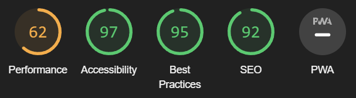
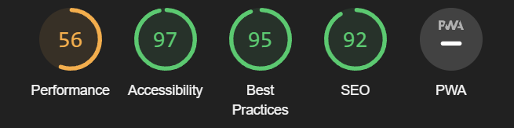
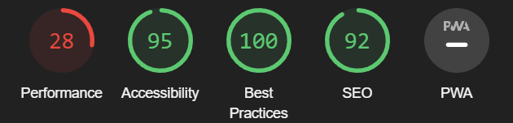

# Path to Mindfulness

Path to Mindfulness is a web page for tips on meditation and breathing.

The purpose of this website is to help people start their journey to mindfulness.

Visit the deployed website [here](https://https://al7819.github.io/path-to-mindfulness/)

## Table of Contents

1. [User Experience (UX)](#user-experience-ux)
    1. [Project Goals](#project-goals)
    2. [User Stories](#user-stories)
    3. [Color Scheme](#color-scheme)
    4. [Typography](#typography)
    5. [Wireframes](#wireframes)
2. [Features](#features)
    1. [General](#general)
    2. [Landing Page](#landing-page)
    3. [Tips Page](#tips-page)
    4. [Signup Page](#signup-page)    
3. [Technologies Used](#technologies-used)
    1. [Languages Used](#languages-used)
    2. [Frameworks, Libraries and Programs Used](#frameworks-libraries-and-programs-used)
4. [Testing](#testing)
    1. [Testing User Stories](#testing-user-stories)
    2. [Code Validation](#code-validation)
    3. [Accessibility](#accessibility)
    4. [Tools Testing](#tools-testing)
    5. [Manual Testing](#manual-testing)
5. [Finished Product](#finished-product)
6. [Deployment](#deployment)
    1. [GitHub Pages](#github-pages)
7. [Credits](#credits)
    1. [Content](#content)
    2. [Media](#media)
    3. [Code](#code)
8. [Acknowledgements](#acknowledgements)
   
   ***
   
   ## User Expierience (UX)

   * The website should have  tranquil and serene design.

   * Present tips on meditation and breathing.

   * Gives the website user a chance to sign up to a newsletter, keeping them updated with tips and mindfulness quotes.
   
   ### User Stories
   
   * As a website user, I want to be able to navigate the wesite comfortably with clear information displayed.
    
   * As a website user, I want to able to find tips on my journey to mindfulness.
    
   * As a website user, I want to be able to recieve updates on the latest tips and quotes on mindfulness.

   ### Color Scheme
   
   * The colors used in the website are white(#ffffff), purple(#5d1c80), light pink on the box-shadow (#f6e9f6), white on the header hover effect (rgb 255, 255, 255), black on the social media icons (rgb 0, 0, 0).

   ### Typography
   
   * There are two fonts used, Figtree for the H1 heading on the home page and Comfortaa for all other fonts with sans-serif used as a fall back incase Figtree or Comftaa is not importing correctly.
   
   ## Features
   
   ### General
   
   * Responsive design across all devices.
  
   * Similar color scheme and design on all pages to present the information to the user.
  
   * **Header**
  
      - The header contains the business logo and fully responsive navigation bar positioned across the top of the screen.
    
      - The navigation bar is the same on all pages and contains links to all pages to facilitate navigation across the website. It also has a hover effect that changes color to provide feedback to the customer for a better user experience.
    
    * **Footer**

      - The footer has links to all the social media accounts.

    ### Landing Page

    * **Main Image**

      - The main image is there to attract the user attention. Represents a path going into the horizon to tie inwith the website name.

    * **Text Section**

      - Contains introduction to the website and a quote on mindfulnesss to tie inwith the website name.
     
    ### Tips Page

      - Contains the tips on meditation, breathing and two pictures.

    ### Signup Page

      - Contains a form to sign up to a newsletter for more tips with a tranquil background picture.

    ## Technologies Used

    ### Languages Used
    * [HTML5](https://en.wikipedia.org/wiki/html5)
    * [CSS3](https://en.wikipedia.org/wiki/css)

    ### Frameworks, Libraries and Programs Used

    * [Google Fonts](https://fonts.google.com/)
       - Google Fonts was used to import the fonts Figtree and Comfortaa into the style.css file. These fonts were used throughout the site.

    * [Font Awesome](https://fontawesome.com/)
        - Font Awesome was used throughout all pages to add icons to create a better User Experience (UX)

    * [Pic Wish](https://picwish.com/)    
        - Pic Wish was used to enhance the main image and signup images.
  
    * [Free Convert](https://freeconvert.com/)
        - Free convert was used to convert the JPG imagesw to WEBP.

    * [GitHub](https://github.com/)
        - GitHub was used to store the project after pushing.

    * [Codeanywhere](https://codeanywhere.com/)
        - Codeanywhere was used to write the code.
    
    * [Chrome DevTools](https://developer.chrome.com/docs/devtools/)
        - Chrome DevTools was used during development process for code review and to test responsiveness.
    
    * [W3C Markup Validator](https://validator.w3.org/)
        - W3C Markup Validator was used to validate the HTML code.

    * [W3C CSS Validator](https://jigsaw.w3.org/css-validator/)
        - W3C CSS Validator was used to validate the CSS code.
    
    ## Testing

    ### Testing User Stories

    * As a website user, I want to be able to navigate the wesite comfortably with clear information displayed.

        - The website has a clear structure for the user to find the information they are looking for.

        - The navigation is clearly presented for customers to find and use.
    
    * As a website user, I want to able to find tips on my journey to mindfulness.
  
        - The tips page provides information that the user may find useful.
    
    * As a website user, I want to be able to recieve updates on the latest tips and quotes on mindfulness.

        - The signup page has a signup form for each user to select the frequency of the newsletter with the latest tips on mindfulness.

    ### Code Validation

    * The [W3C Markup Validator](https://validator.w3.org/) and [W3C CSS Validator](https://jigsaw.w3.org/css-validator/) services were used to validate all pages of the project in order to ensure there were no syntax errors.
  
        - The W3C Css Validator found an error to be missing a semicolon before the height property. The semicolon was added to fix this problem.
  
        - The W3C Markup Validator found no issue with the code.

    ### Accessibility

* Used Lighthouse in Chrome DevTools to confirm that the colors and fonts being used in throughout the website are easy to read and accessible.

* Lighthouse reports

    - **Landing Page**

    

    - **Tips Page**

    

    - **Signup Page**

    

### Manual Testing

* Browser Compatibility

    - The website has been tested on the following browsers:

        - **Goolgle Chrome**
        
        No appearance, responsiveness nor functionality issues.

        - **Safari**
        
        No appearance, responsiveness nor functionality issues.

        - **Mozilla Firefox**
        
        There was and issue with the appearance of the book buttons on the treatments page expanding all the width. This issue was corrected by changing the width property value from "fit-content" to "max-content".
        
        No responsiveness nor functionality issues.

        - **Microsoft Edge**
        
        No appearance, responsiveness nor functionality issues.

* Device compatibility

    - The website has been tested on multiple devices, including:

        - **Iphone SE**

        No appearance, responsiveness nor functionality issues.

        - **Ipad Mini**

        No appearance, responsiveness nor functionality issues.

        - **Galaxy Fold**

        No appearance, responsiveness nor functionality issues.

        - **Laptop**

        No appearance, responsiveness nor functionality issues.

        - **Desktop**

        No appearance, responsiveness nor functionality issues.

* Common Elements Testing

        - All Pages
        
        - **Header**

            - Clicking on the website name in the header will bring the user back to the home page.

        - **Navigation Bar**

            - Hovering the mouse over social media icons and navigation bar's links will trigger the hover effect, highlighting each link for the user.

            - Clicking on the navigation bar's links will bring the user to the selected page.
        
        - **Footer**
        
            - Clicking on the social media links will open the specific website on a new tab.    

    - Signup Page

        - When filling out the book now form, the user is required to complete all fields before submitting.

    ## Finished Product

    Page | Desktop version | Mobile version
    --- | --- | ---
    

    ## Deployment

    * This website was developed using [Github](https://www.github.com/).

    ## Credits 

    ### Content

    - All content was written by the developer.

    ### Media

    * [Unsplash](https://unsplash.com/)

    - About Us image: "Pristine water lily" by Jay Castor.
    - Massage image: "Beautiful Woman Getting Stones Massage in Spa Salon" by Engin Akyurt.
    - Facial image: Taken by Raphael Lovaski.
    - Pedicure image: "Warm bath before treatment" by Rune Enstad.
    - Book Now image: Taken by Firos Nv.

    ### Code

    * [Stack Overflow](https://stackoverflow.com/) and [W3Schools](https://www.w3schools.com/) were consulted on a regular basis for inspiration and sometimes to be able to better understand the code being implement.

        
        

